## Part 1. Установка ОС

##### **Ubuntu 20.04 Server LTS** установилась
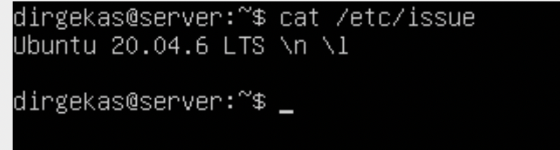

## Part 2. Создание пользователя

##### Создаём нового пользователя (`sudo adduser new_user_1`) и добавляем его в группу adm (`sudo usermod -aG adm new_user_1`)

##### Переходим к пользователю - `sudo su new_user_1` и проверяем его группу `groups`
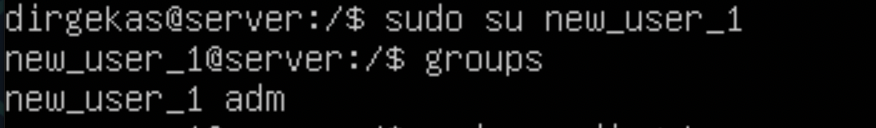
##### Вывод команды `cat /etc/passwd` 
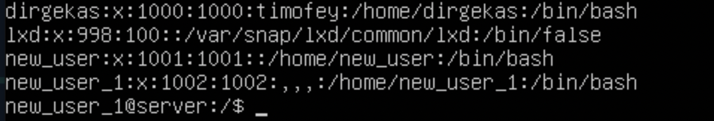

## Part 3. Настройка сети ОС

##### Редактирую файл `/etc/hosts` при помощи Vim. И выхожу с сохранением(`:wq`)
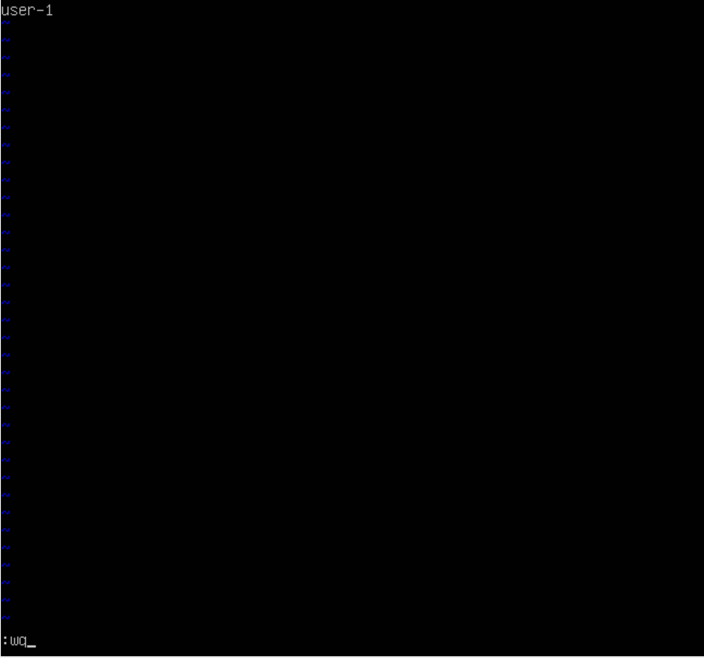
##### Название машины действительно поменялось
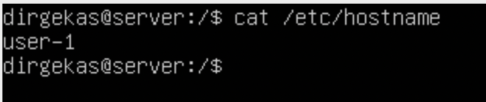

##### Узнаю текущий часовой пояс: `timedatectl`
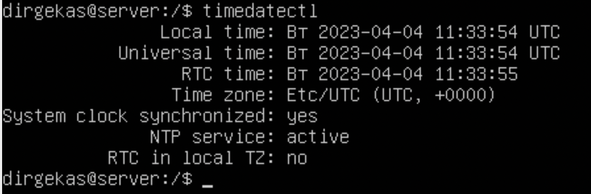
##### Команда `timedatectl list-timezones` выводит список длинных названий часовых поясов.
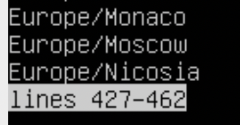
##### Находим Москву. Часовой пояс Москвы записан, как `Europe/Moscow`
#####  Меняем часовой пояс: `sudo timedatectl set-timezone Europe/Moscow` и проверяем изменения
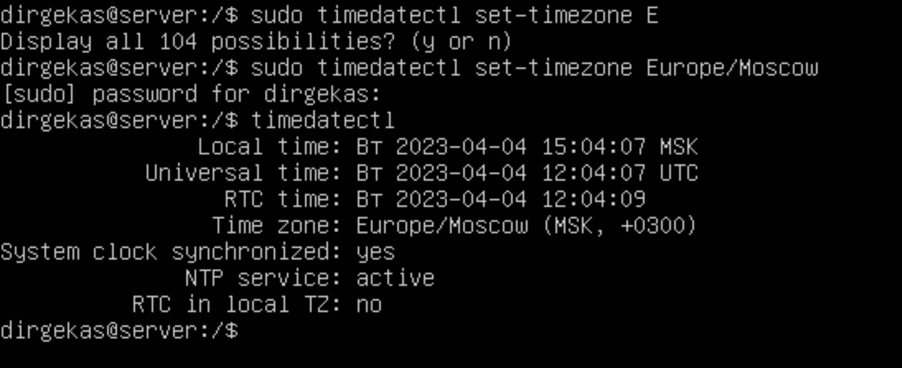

##### Вывести названия сетевых интерфейсов с помощью консольной команды.
##### Вывожу названия сетевых интерфейсов
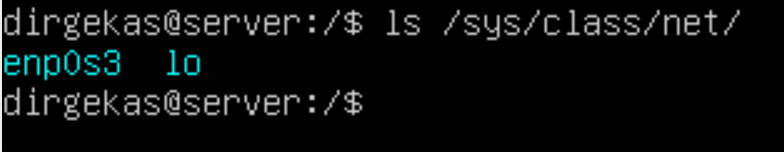
- Объяснение наличия lo в списке с сетевыми интерфейсами. 

  lo (loopback device) – виртуальный интерфейс, присутствующий по
умолчанию в любом Linux. Он используется для отладки сетевых программ
и запуска серверных приложений на локальной машине. С этим интерфейсом
всегда связан адрес 127.0.0.1. У него есть dns-имя – localhost.
##### Используя консольную команду получить ip адрес устройства, на котором вы работаете, от DHCP сервера.
##### `hostname -I` - вывод ip-адреса
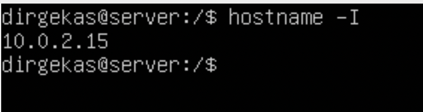
##### DHCP (англ. Dynamic Host Configuration Protocol — протокол динамической настройки узла) — сетевой
протокол, позволяющий компьютерам автоматически получать IP-адрес
и другие параметры, необходимые для работы в сети.
##### `curl ifconfig.me` - внешний ip - адрес
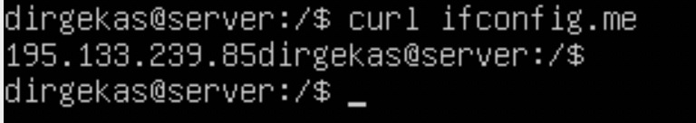
##### `ip route` - внутренний ip - адрес
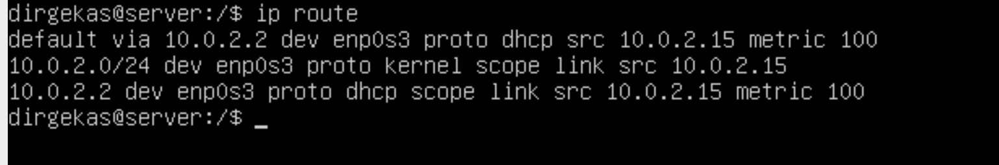
##### Задать статичные (заданные вручную, а не полученные от DHCP сервера) настройки ip, gw, dns (использовать публичный DNS серверы, например 1.1.1.1 или 8.8.8.8).
##### Перезагрузить виртуальную машину. Убедиться, что статичные сетевые настройки (ip, gw, dns) соответствуют заданным в предыдущем пункте.
##### Открываем файл 00-installer-config.yaml - `sudo vim /etc/netplan/00-installer-config.yaml` и устанавливаем значение dhcp4 равное no.
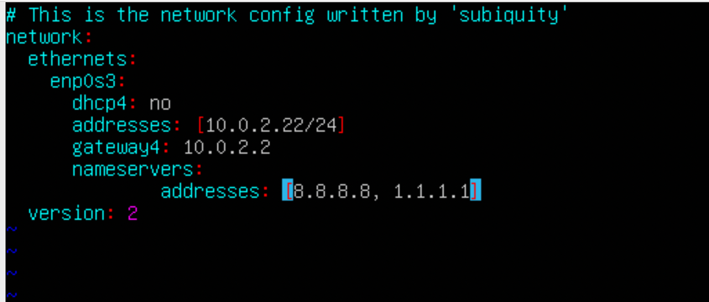
##### Чтобы применить внесенные изменения, выполнием команду: `sudo netplan apply`
##### Проверяем получили ли мы статичный ip - `ip route`
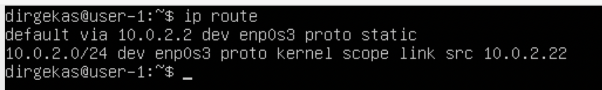
##### Перезагружаем виртуальную машину и проверяем снова
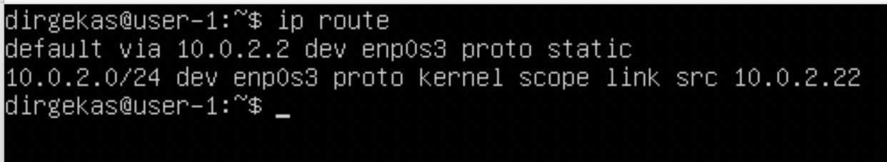
- В отчёте опишите, что сделали для выполнения всех семи пунктов (можно как текстом, так и скриншотами).
- Успешно пропинговать удаленные хосты 1.1.1.1 и ya.ru и вставить в отчёт скрин с выводом команды. В выводе команды должна быть фраза "0% packet loss".
##### Пропингуем удаленные хосты 1.1.1.1 и ya.ru
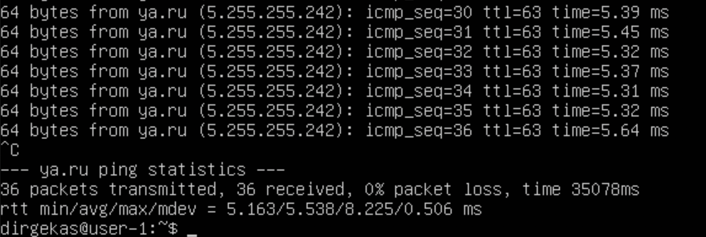
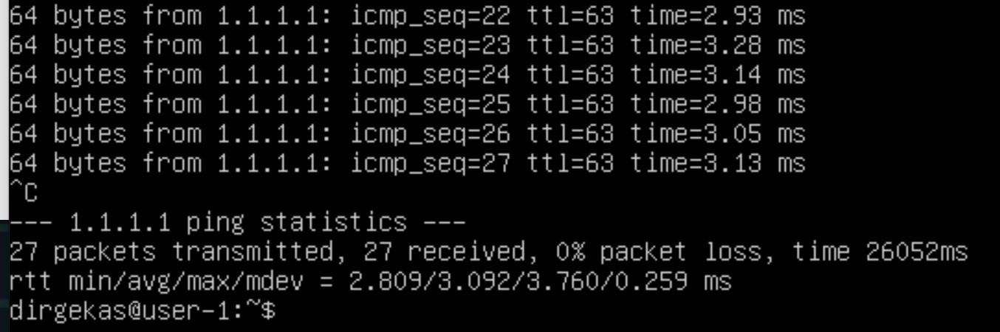

## Part 4. Обновление ОС

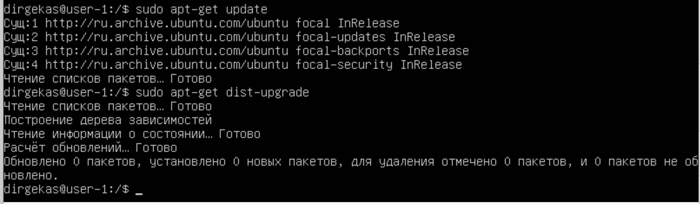

## Part 5. Использование команды **sudo**

Команда sudo ( substitute user and do, подменить пользователя и выполнить )
позволяет строго определенным пользователям выполнять указанные программы с
- административными привилегиями без ввода пароля суперпользователя root.
##### `sudo usermod -aG sudo new_user_1` - разрешил пользователю выполнять команду sudo.
##### `sudo su new_user_1` - переключился на этого пользователя
##### в vim изменил название на `part5`
##### перезагрузил виртуальную машину и убедился в изменениях
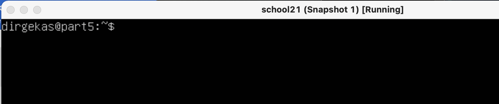

## Part 6. Установка и настройка службы времени

- Время, часовой пояс, в котором сейчас находимся.
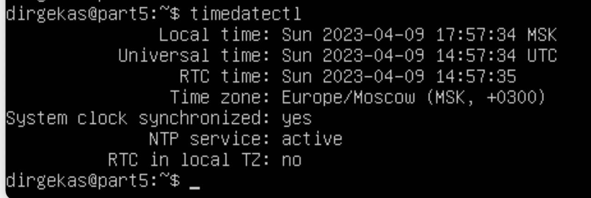

##### Устанавливаем systemd-timesyncd - `sudo apt install systemd-timesyncd`
##### Открываем /etc/systemd/timesyncd.conf - `sudo vim /etc/systemd/timesyncd.conf` и задаем FallbackNTP равный `ntp.sbercloud.ru`
##### systemctl restart systemd-timesyncd - перезапускаем
##### `systemctl status systemd-timesyncd.service` - проверяем запущена ли служба `systemd-timesyncd`
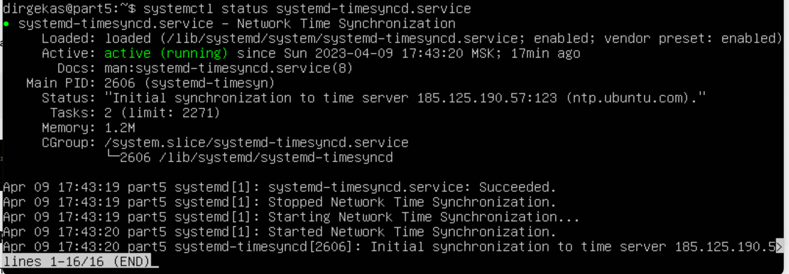
- Проверяем статус синхронизации часов
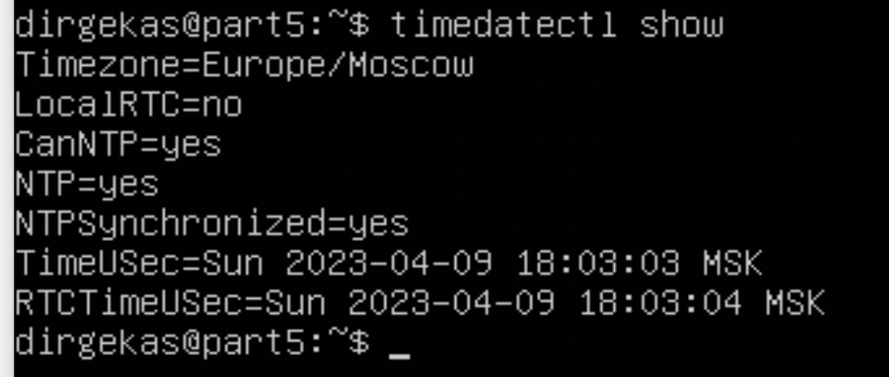

## Part 7. Установка и использование текстовых редакторов

- `sudo apt install joe` - устанавливаем Joe. Vim и nano уже установлены.
### VIM
- `vim test_vim.txt` - создаю и открываю файл.

- Для выхода с сохранением: `(esc):wq`

### Nano
- `nano test_nano.txt` - создаю и открываю файл.
  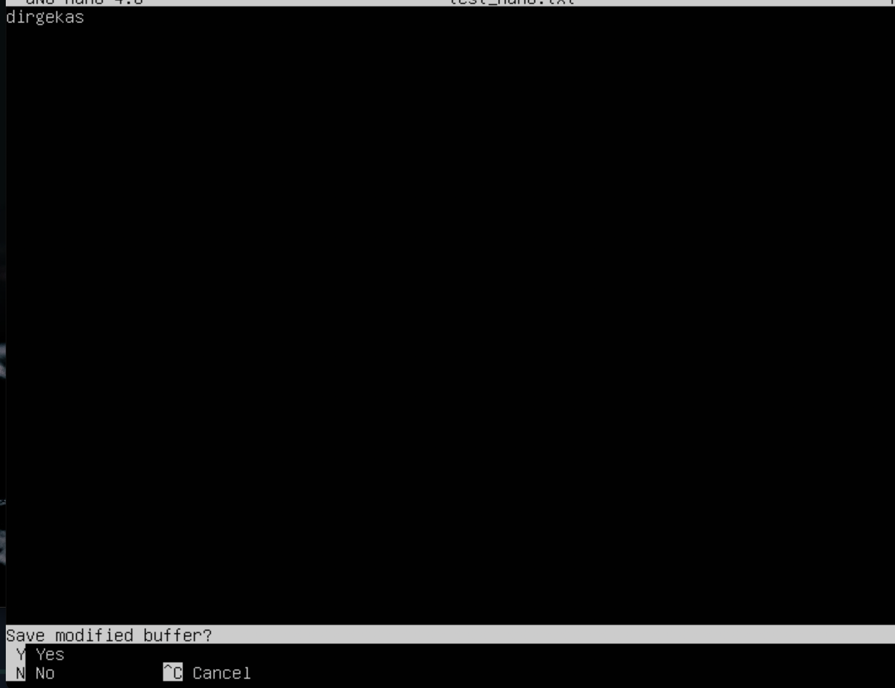
- Нажимаю `control + X`, чтобы выйти. `Y` - нажимаю yes, чтобы выйти с сохранением.  `enter` - подтверждаю название файла.

### joe
- `joe test_joe.txt` - создаю и открываю файл.
  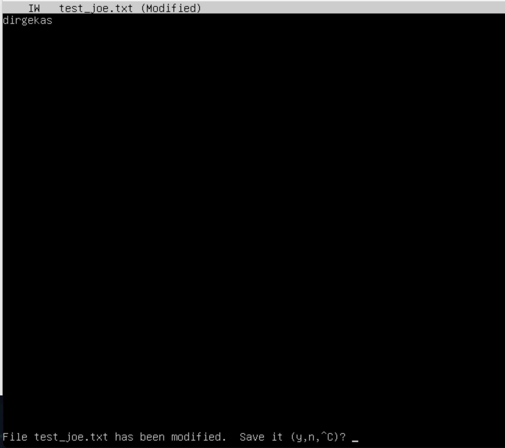
- Нажимаю `control + k + q`, чтобы выйти. `y` - нажимаю yes, чтобы выйти с сохранением.

### VIM
- `vim test_vim.txt` - открываю файл.
  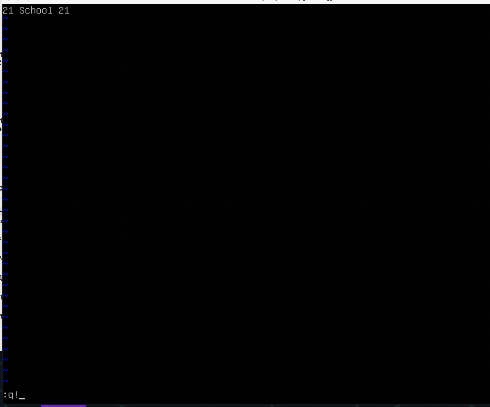
- Для выхода без сохранения: `(esc):q!`
- 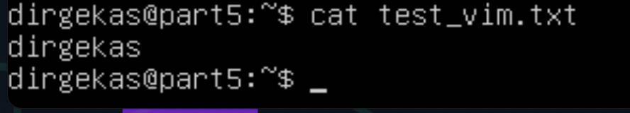

### Nano
- `nano test_nano.txt` - открываю файл.
  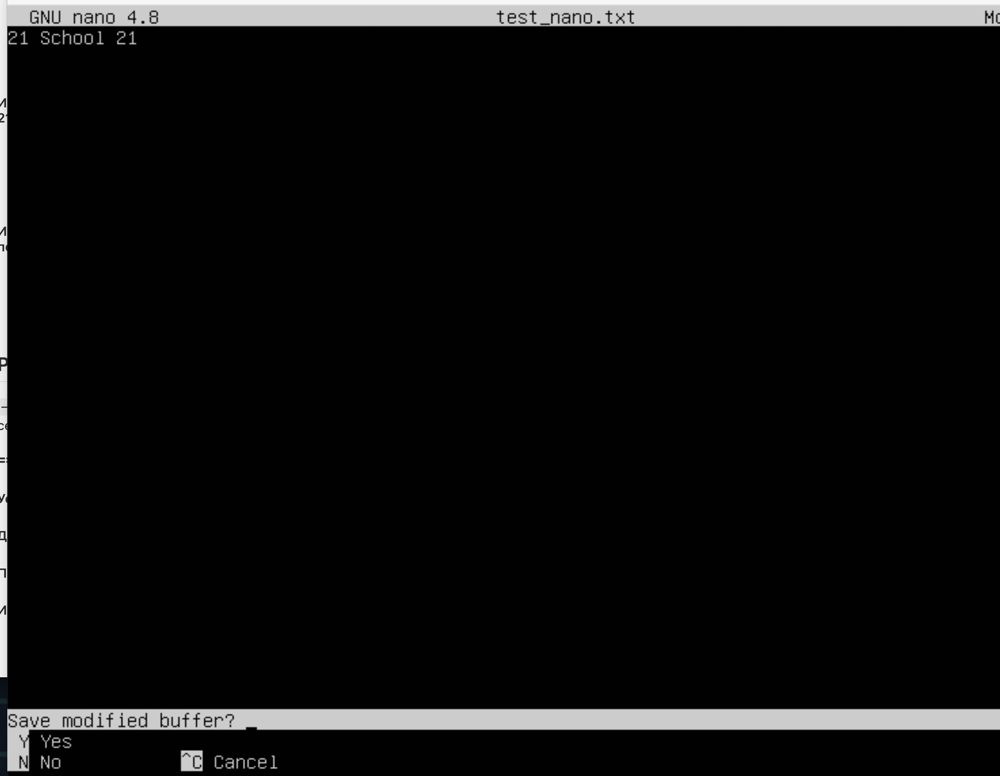
- Нажимаю `control + X`, чтобы выйти. `n` - нажимаю no, чтобы выйти без сохранения.  `enter` - подтверждаю название файла.
- 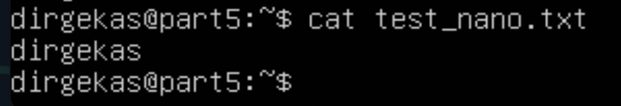

### joe
- `joe test_joe.txt` - открываю файл.
  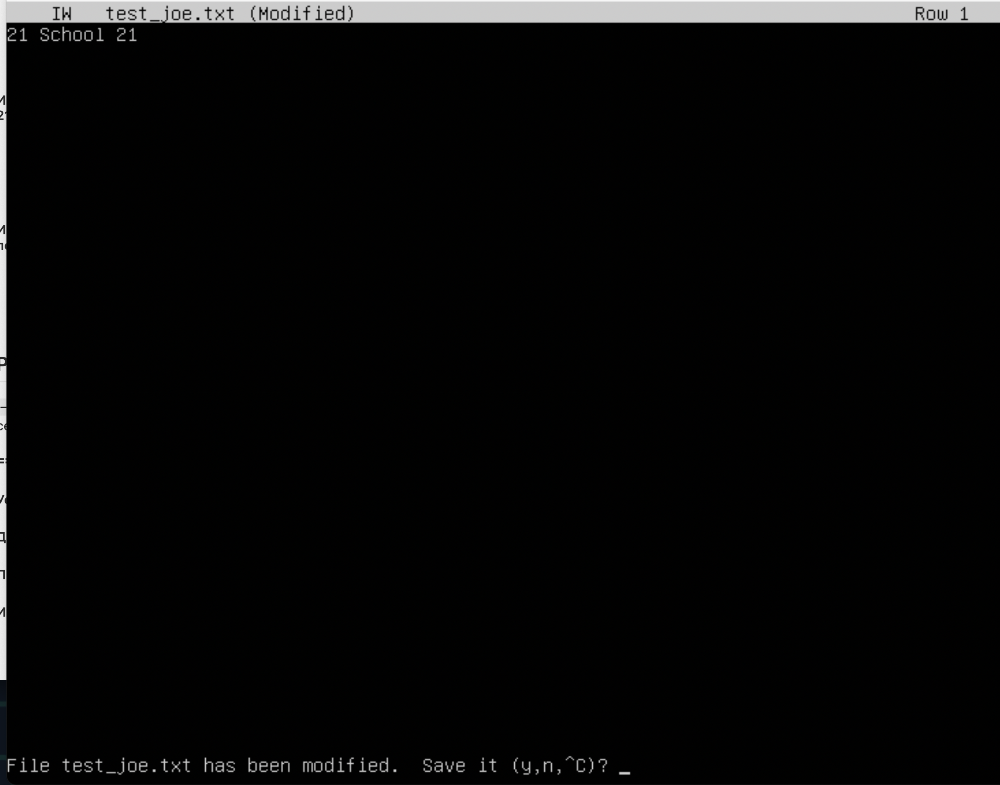
- Нажимаю `control + k + q`, чтобы выйти. `n` - нажимаю no, чтобы выйти без сохранения.
- 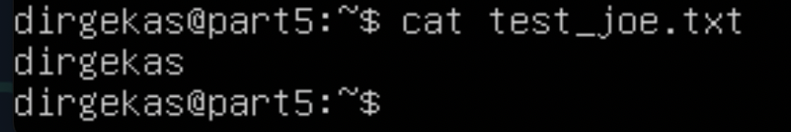

### VIM
- `vim test_vim.txt` - открываю файл.
  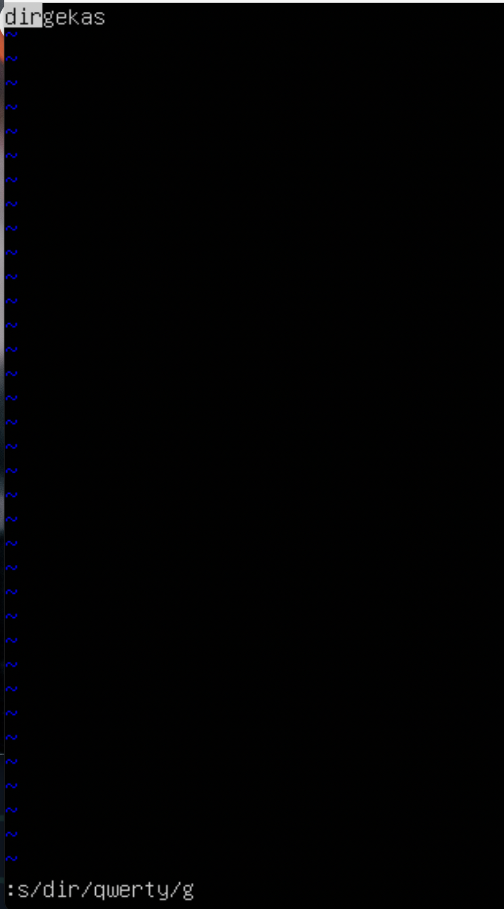
- с помощью `(esc):s/` можно искать слова
- и заменять их. заменяю dir на qwerty: `(esc):s/dir/qwerty/g`
- флаг g нужен для замены во всём файле

### Nano
- `nano test_nano.txt` - открываю файл.
  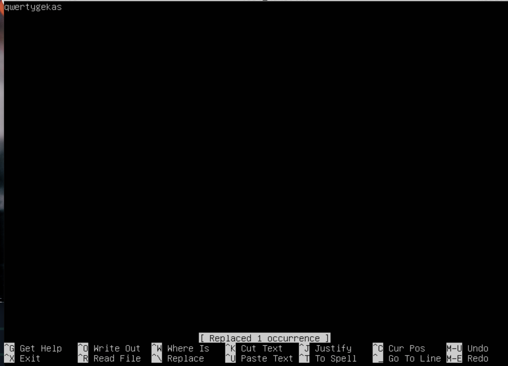
- Нажимаю `control + \`, чтобы войти в режим замены. Ввожу слово, которое нужно заменить. Ввожу слово, на которое нужно заменить. нажимаю yes.

### joe
- `joe test_joe.txt` - открываю файл.
  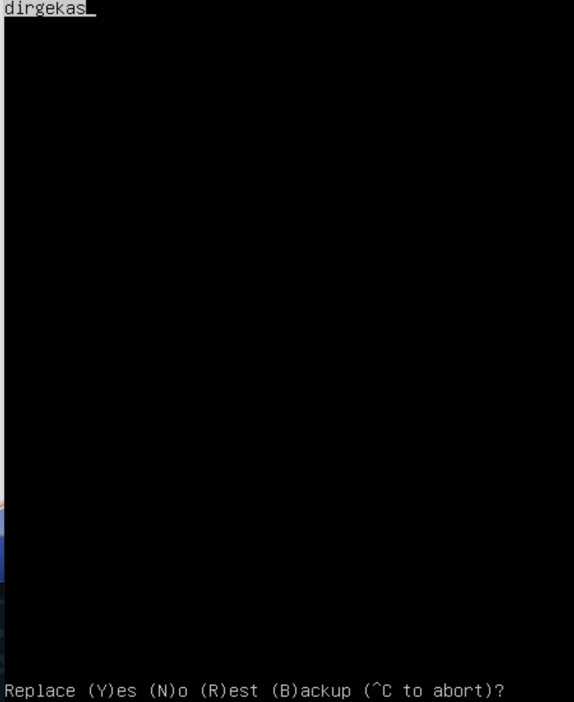
- Нажимаю `control + k + f`, чтобы войти в режим поиска. Ввожу слово, которое нужно заменить. Выбираю режим r(replace). Ввожу слово, на которое нужно заменить. нажимаю yes.

## Part 8. Установка и базовая настройка сервиса **SSHD**

##### `sudo apt-get install openssh-server` - Установка OpenSSH в Ubuntu
- `sudo systemctl enable sshd` - Добавляю автостарт службы при загрузке системы.
  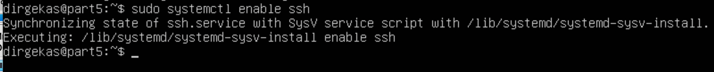

- Все настройки сервера SSH хранятся в конфигурационном файле sshd_config, который находится в папке /etc/ssh. Перед тем как вносить изменения в этот конфигурационный файл
сделаем его резервную копию:`sudo cp /etc/ssh/sshd_config /etc/ssh/sshd_config.factory-defaults`
- Теперь открываем этот файл через Vim
 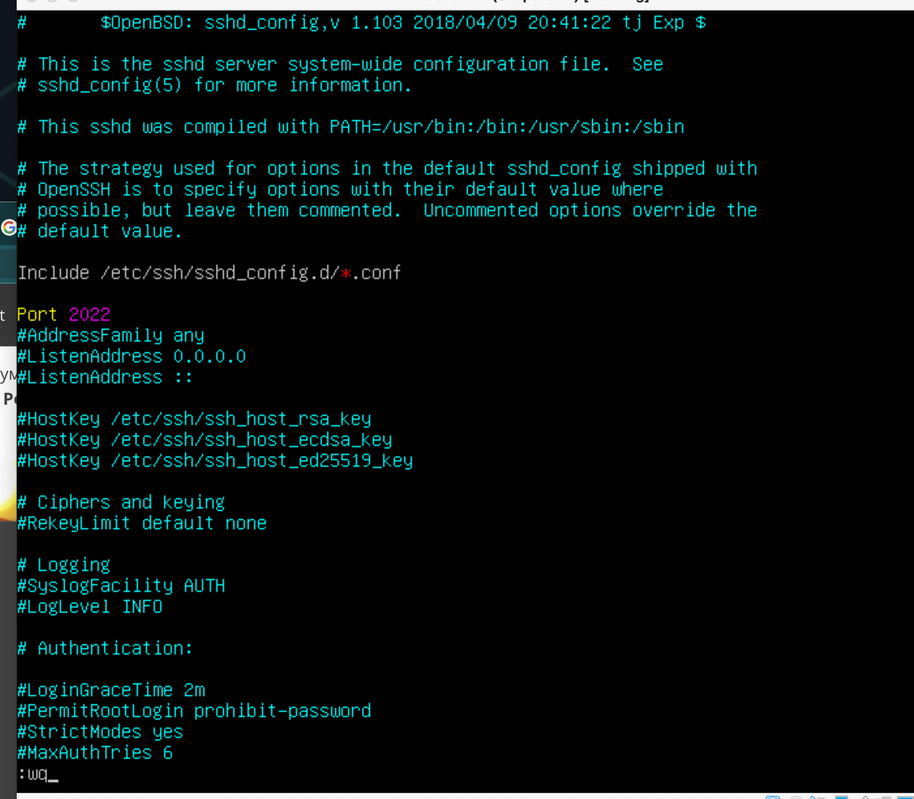
- Находим строку с надписью `#Port` и меняем на 2022. Также нужно удалить решётку, чтобы раскомментировать строку. Далее выходим с сохранением.
- `ps -A(-e)` - флаги A и e выбирают все процессы
  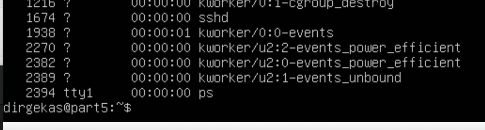
-Команда ps(process status) является очень гибким инструментом для определения работающих в системе программ и оценки используемых ими ресурсов. Она выводит статистику и 
информацию о состоянии процессов в системе, в том числе ИД процесса или нити, объем выполняемого ввода-вывода и используемый объем ресурсов процессора и памяти.
- `sudo systemctl restart ssh` - перезапускаем службу SSH
  
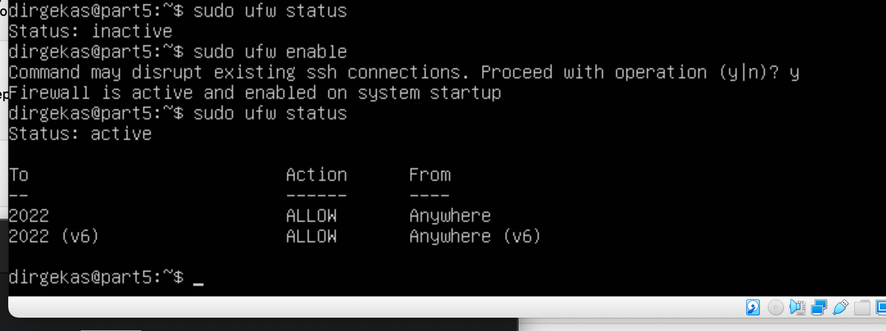
- запускаю Firewall
- разрешил доступ к новому порту ssh: `sudo ufw allow 2222`
##### Перезапустил систему
- вывод команды `netstat -tan`

##### Объяснение ключей:
- t - показывает только TCP порты
- a - Отображение всех подключений и ожидающих портов.
- n - Отображение адресов и номеров портов в числовом формате.
##### Объяснение столбцов:
- Proto - протокол сокета
- Recv-Q - количество полученных пакетов в очереди
- Send-Q - количество отправленных пакетов в очереди
- Local Address - адрес и номер порта локального конца сокета
- Foreign Address - адрес и номер порта удаленного конца сокета
- State - состояние сокета
- значение 0.0.0.0 означает, что порт прослушивается на всех "сетевых интерфейсах" (т.е. на вашем компьютере, модеме (модемах) и сетевой карте (картах)).

## Part 9. Установка и использование утилит **top**, **htop**

##### запустил утилиты top и htop.
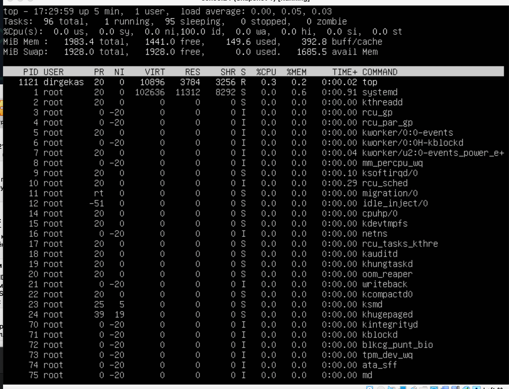
  - uptime - 5 min
  - количество авторизованных пользователей - 1 
  - общую загрузку системы - 0.00, 0.05, 0.03
  - общее количество процессов - 96 total, 1 running, 95 sleeping, 0 stopped, 0 zombie
  - загрузку cpu - 0.0 us, 0.0 sy, 0.0 ni, 100.0 id, 0.0 wa, 0.0 hi, 0.0 si, 0.0 st
  - загрузку памяти - 1983.4 total, 1441.0 free, 149.6 used, 392.8 buff/cache
  - pid процесса занимающего больше всего памяти - 721
    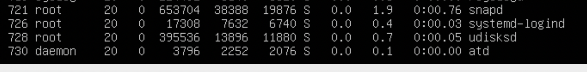
  - pid процесса, занимающего больше всего процессорного времени - 1160
    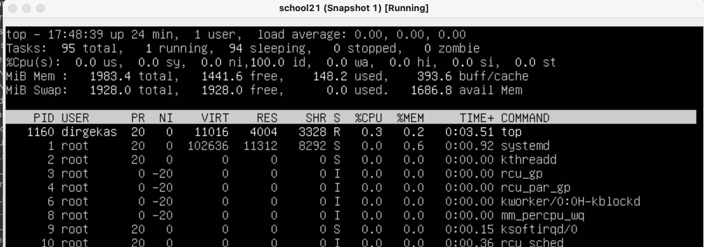
- Вывод команды htop:
  - Сортировка по PID
    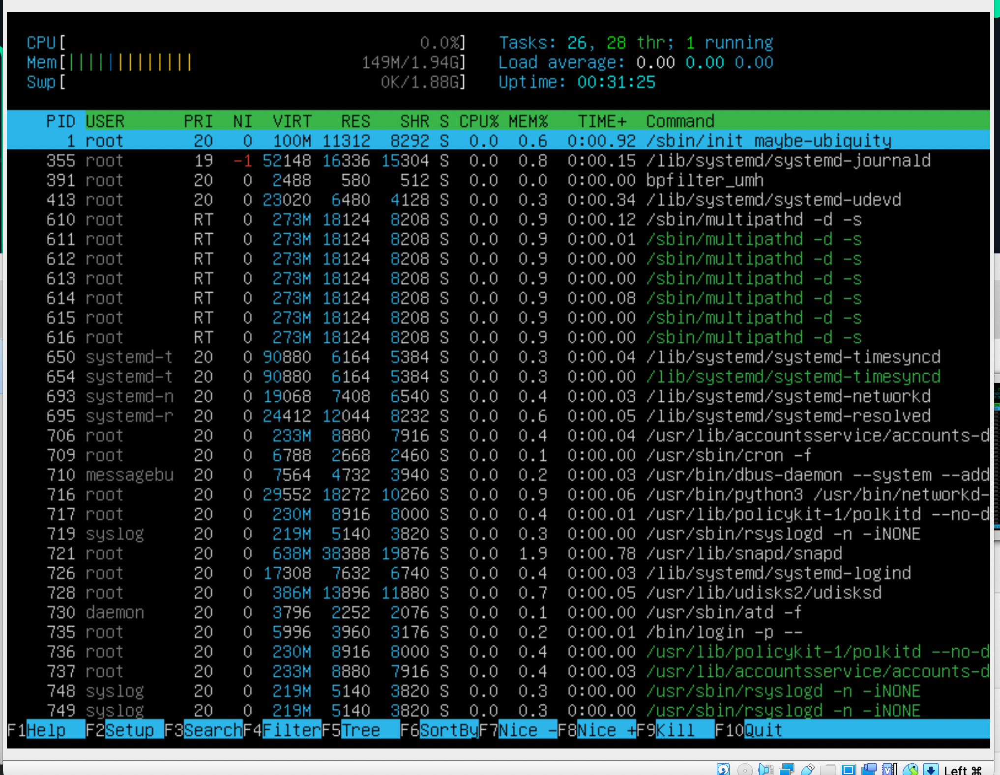

  -Сортировка по PERCENT_CPU
   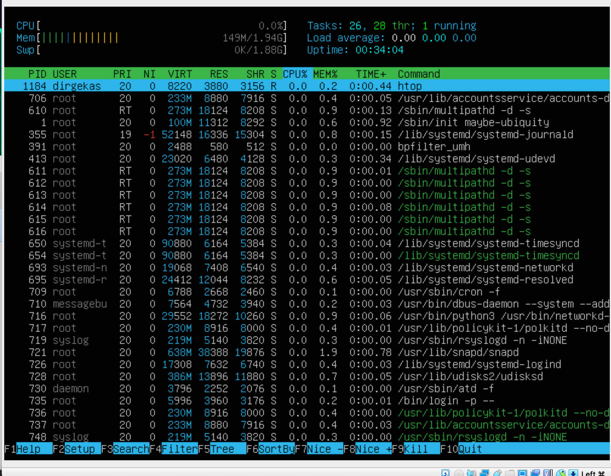

  -Сортировка по PERCENT_MEM
    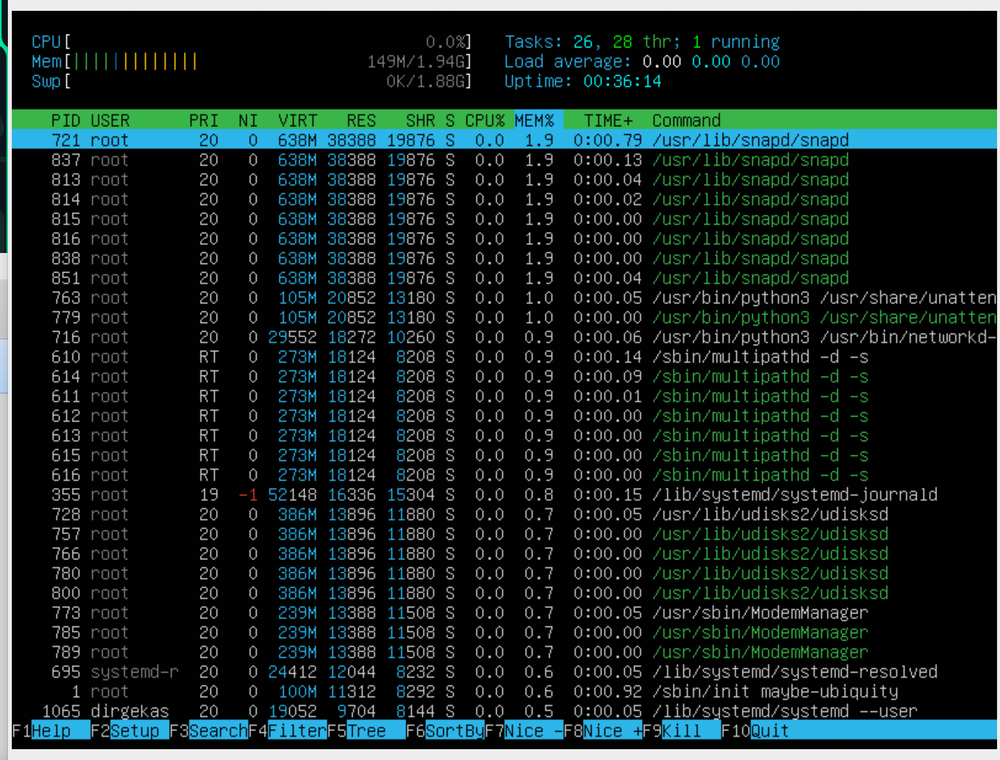

  -Сортировка по TIME
    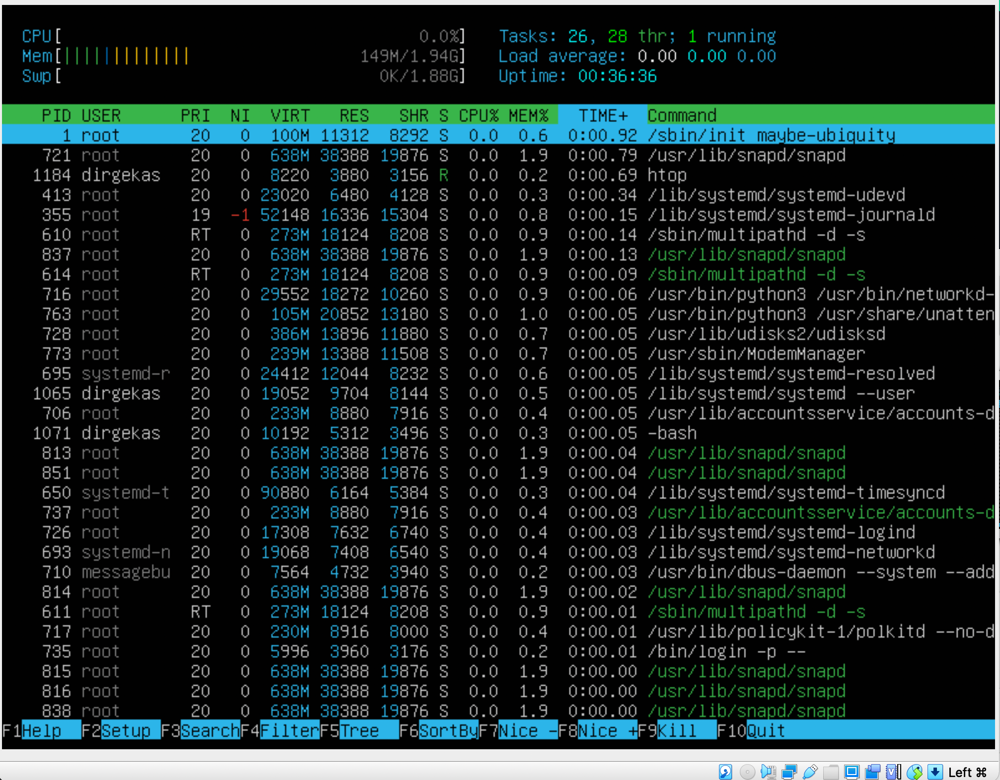

  - отфильтрованному для процесса sshd
    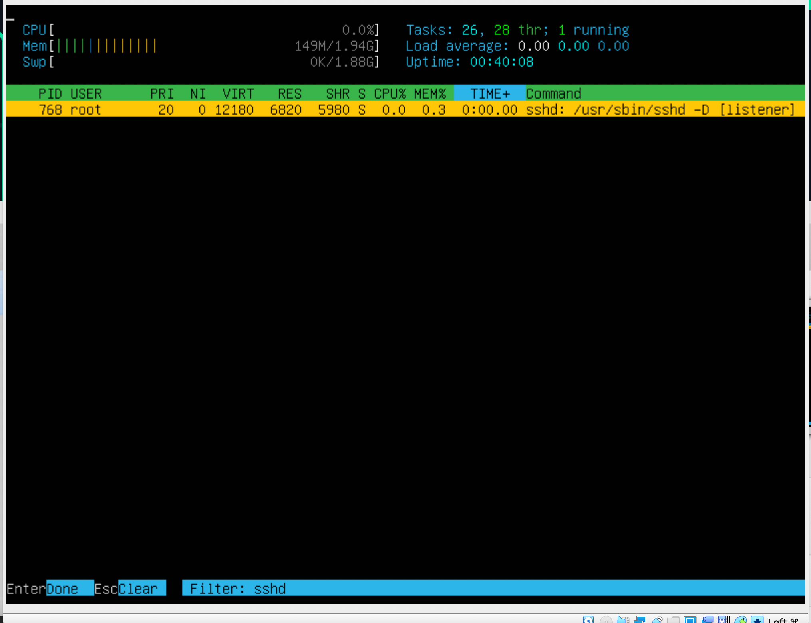
  
  - с процессом syslog, найденным, используя поиск
    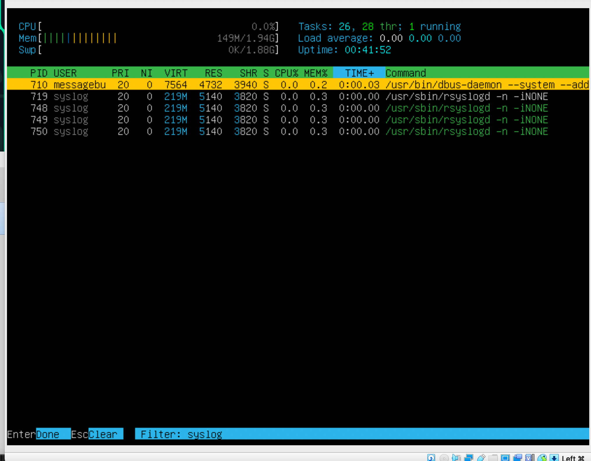
  
  - с добавленным выводом hostname, clock и uptime
    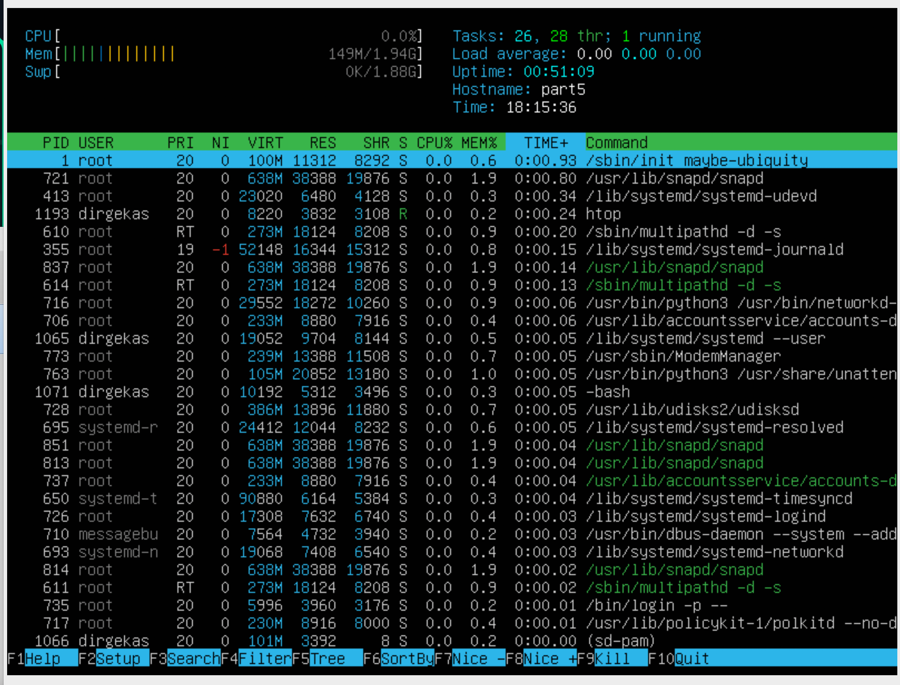

  
## Part 10. Использование утилиты **fdisk**

 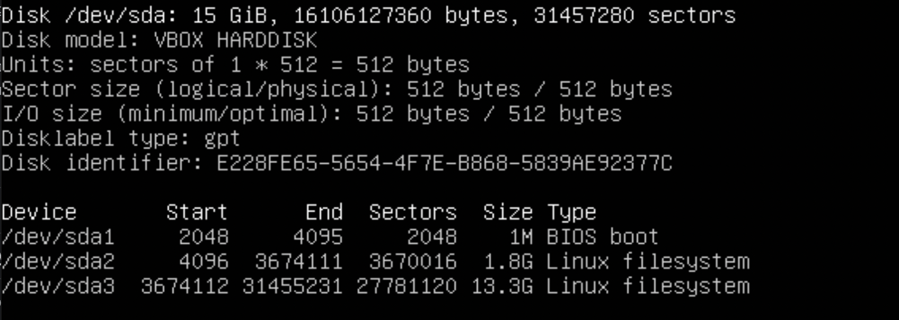
- название жесткого диска - /dev/sda 
- размер - 15 Гб
- количество секторов - 31457280 
- размер swap - 1.9 Гб
  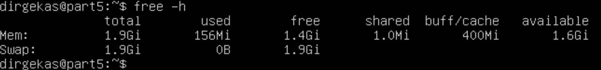
- 
## Part 11. Использование утилиты **df**

##### Команда df.
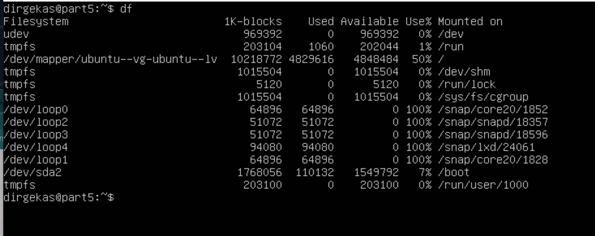
- В отчёте написать для корневого раздела (/):
  - размер раздела - 10218772
  - размер занятого пространства - 4829616
  - размер свободного пространства - 4848484
  - процент использования - 50%
- единица измерения в выводе - килобайт

#####  Команда df -Th.
 
- В отчёте написать для корневого раздела (/):
    - размер раздела - 9.8 Гб
    - размер занятого пространства - 4.7 Гб
    - размер свободного пространства - 4.7 Гб
    - процент использования - 50%
- Тип файловой системы для раздела - ext4

## Part 12. Использование утилиты **du**

- Запустил команду du
  
- Вывод размера папок /home, /var, /var/log (в байтах, в человекочитаемом виде)
  
- Вывод размера всего содержимого в /var/log (не общее, а каждого вложенного элемента, используя *)
  

## Part 13. Установка и использование утилиты **ncdu**

##### Установил утилиту ncdu.


- Просканируем всю файловую систему: `ncdu -x /`
 
тут видно размеры /home и /var
- Просканируем папку /var

тут видно размер /var/log

## Part 14. Работа с системными журналами

##### Открыл для просмотра:
##### 1. sudo cat /var/log/dmesg

##### 2. sudo cat /var/log/syslog

##### 3. sudo cat /var/log/auth.log

- Время последней успешной авторизации, имя пользователя и метод входа в систему: `sudo cat /var/log/auth.log | grep login`
  
  - Время - 10 Апреля 17:25:14
  - Имя пользователя - dirgekas
  - Метод входа в систему - systemd-logind 
- Перезапустил службу SSHd.

- Вставил в отчёт скрин с сообщением о рестарте службы (искал в логах): `grep restart /var/log/auth.log`


## Part 15. Использование планировщика заданий **CRON**

##### Используя планировщик заданий, запустите команду uptime через каждые 2 минуты.
 - открываю файл через `crontab -e` и задаю запуск команды uptime через каждые 2 минуты.

 - Найти в системных журналах строчки (минимум две в заданном временном диапазоне) о выполнении.
   
 - Вывести на экран список текущих заданий для CRON.
   

##### Удалил все задания из планировщика заданий.


💡 [Нажми тут](https://forms.yandex.ru/cloud/641817c002848f26a078c4a6/), **чтобы поделиться с нами обратной связью на этот проек**т. Это анонимно и поможет команде Педаго сделать твоё обучение лучше.
